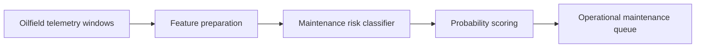

# oilfield-equipment-predictive-maintenance

## Português

`oilfield-equipment-predictive-maintenance` é um projeto de manutenção preditiva para equipamentos de campo em oil & gas. Ele foi estruturado para ser lido em camadas: do entendimento mais básico do problema até a parte mais técnica de modelagem e avaliação.

## Leitura rápida

### O que este projeto faz

O projeto tenta responder uma pergunta simples:

- **esta janela operacional já indica risco suficiente para manutenção?**

Em vez de esperar a falha acontecer, o pipeline analisa sinais operacionais de equipamentos e estima a probabilidade de uma intervenção ser necessária.

### O que ele usa

- telemetria de equipamentos;
- um classificador supervisionado;
- métricas de priorização e separação;
- artefatos prontos para análise operacional.

### Resultado atual

- `roc_auc = 0.9381`
- `average_precision = 0.9308`
- `f1 = 0.8409`

## Contexto de negócio

### Por que isso importa em oil & gas

Em operações de campo, o problema não é só falha técnica. O impacto real costuma vir de:

- parada não planejada;
- perda de produtividade;
- custo de intervenção emergencial;
- risco operacional maior em ativos degradados.

Por isso, manutenção preditiva é valiosa porque transforma telemetria em decisão antecipada. Em vez de reagir à falha, a operação tenta identificar:

- ativos que estão se deteriorando;
- janelas em que o comportamento saiu do padrão;
- casos que já merecem inspeção, manutenção ou troca preventiva.

## Base pública escolhida

### Referência pública

O projeto usa como referência de domínio o **3W Dataset**, da **Petrobras**, por ser uma base pública conhecida para eventos indesejáveis em poços de petróleo e gás.

Referência local:

- [public_dataset_reference.json](/Users/flaviagaia/Documents/CV_FLAVIA_CODEX/oilfield-equipment-predictive-maintenance/data/raw/public_dataset_reference.json)

### Por que essa base dá relevância ao projeto

Porque ela conecta o projeto diretamente ao universo de:

- telemetria operacional;
- eventos raros;
- monitoramento industrial;
- oil & gas.

Ou seja, não é um projeto genérico de manutenção. Ele está ancorado em um problema real do setor.

### Como o projeto usa essa referência

Para manter o repositório leve e reproduzível, o runtime não embute a base pública completa. Em vez disso, ele usa uma **amostra local `3W-style`**, desenhada para preservar o tipo de sinais e a lógica operacional do problema.

Arquivo da amostra:

- [oilfield_telemetry_3w_style_sample.csv](/Users/flaviagaia/Documents/CV_FLAVIA_CODEX/oilfield-equipment-predictive-maintenance/data/raw/oilfield_telemetry_3w_style_sample.csv)

## Storytelling técnico

Manutenção preditiva em oil & gas raramente é só “prever falha”. Na prática, a operação quer responder:

- qual ativo está degradando?
- qual janela já parece anormal?
- qual equipamento deve entrar na fila de manutenção primeiro?

Esse projeto foi desenhado com essa mentalidade. Ele não trabalha com uma falha abstrata e distante; ele trabalha com **janelas operacionais**, e o rótulo do problema é:

- `maintenance_required`

Ou seja, a pergunta do modelo é diretamente útil para operação.

## O que o projeto faz, passo a passo

1. gera uma base sintética `3W-style` de telemetria;
2. organiza os sinais por janela operacional;
3. define um rótulo binário de manutenção requerida;
4. separa treino e teste de forma estratificada;
5. aplica pré-processamento estruturado;
6. treina um `RandomForestClassifier`;
7. gera probabilidade de manutenção por janela;
8. exporta as janelas pontuadas para análise.

## Arquitetura do repositório

- [src/sample_data.py](/Users/flaviagaia/Documents/CV_FLAVIA_CODEX/oilfield-equipment-predictive-maintenance/src/sample_data.py)  
  Gera a base sintética inspirada no 3W e registra a referência pública.
- [src/modeling.py](/Users/flaviagaia/Documents/CV_FLAVIA_CODEX/oilfield-equipment-predictive-maintenance/src/modeling.py)  
  Implementa o pipeline de classificação, o treino e a avaliação.
- [main.py](/Users/flaviagaia/Documents/CV_FLAVIA_CODEX/oilfield-equipment-predictive-maintenance/main.py)  
  Executa o benchmark ponta a ponta.
- [tests/test_project.py](/Users/flaviagaia/Documents/CV_FLAVIA_CODEX/oilfield-equipment-predictive-maintenance/tests/test_project.py)  
  Garante o contrato mínimo do projeto.

### Pipeline conceitual

## Dataset local

### Estrutura da base

Cada linha representa uma janela operacional de um ativo:

- `asset_id`
- `window_id`
- `discharge_pressure`
- `suction_pressure`
- `line_pressure`
- `temperature`
- `vibration`
- `motor_current`
- `flow_rate`
- `maintenance_required`

### Significado dos campos

#### `asset_id`

Identifica o equipamento ou unidade operacional.

#### `window_id`

Identifica a janela analisada dentro daquele ativo.

#### `discharge_pressure`

Proxy de pressão de descarga do ativo. No sample, ajuda a representar perda de eficiência sob degradação.

#### `suction_pressure`

Proxy de pressão de sucção, útil para observar comportamento hidráulico do sistema.

#### `line_pressure`

Representa a pressão da linha, ajudando a compor o contexto operacional.

#### `temperature`

Importante porque sobreaquecimento costuma aparecer como sinal de degradação mecânica ou elétrica.

#### `vibration`

Um dos sinais mais clássicos para manutenção preditiva, especialmente em equipamentos rotativos.

#### `motor_current`

Ajuda a capturar esforço elétrico adicional e carga anormal do ativo.

#### `flow_rate`

Proxy de performance operacional. Queda de vazão pode indicar perda de eficiência.

#### `maintenance_required`

Rótulo binário do problema. Indica que a janela já apresenta condição suficiente para manutenção.

## Como a base foi desenhada

A amostra local foi construída para simular degradação operacional progressiva:

- aumento de `vibration`;
- elevação de `temperature`;
- aumento de `motor_current`;
- queda de `flow_rate`;
- redução de `discharge_pressure`.

O rótulo positivo aparece quando essa combinação ultrapassa um limiar de risco ou quando um evento indesejado é introduzido de forma controlada.

Essa estrutura faz o sample ser útil para benchmark porque existe uma relação coerente entre os sensores e o desfecho.

## Técnicas utilizadas

## Nível intermediário

### 1. Pré-processamento estruturado

O pipeline separa:

- features numéricas;
- a feature categórica `asset_id`.

Para isso, usa `ColumnTransformer` com:

- `SimpleImputer(strategy="median")` nas numéricas;
- `SimpleImputer(strategy="most_frequent")` na categórica;
- `OneHotEncoder(handle_unknown="ignore")` para `asset_id`.

### Por que isso importa

Porque manutenção preditiva costuma lidar com:

- sinais numéricos contínuos;
- tipos de ativo diferentes;
- pequenas lacunas de dado;
- necessidade de pipeline reproduzível.

### 2. Classificação supervisionada

O modelo principal é um `RandomForestClassifier`.

### Por que esse modelo foi escolhido

- lida bem com relações não lineares;
- funciona bem em tabular;
- aceita interações entre sinais sem grande feature engineering manual;
- é uma baseline forte para MVP industrial.

### 3. Probabilidade de manutenção

O projeto não gera só classe binária. Ele gera:

- `predicted_probability`

Isso é importante porque a operação normalmente prefere:

- ordenar ativos por risco;
- aplicar thresholds diferentes;
- usar score para priorização.

## Estratégia de modelagem

O pipeline executa:

1. leitura da telemetria;
2. separação entre features e rótulo;
3. `train_test_split` estratificado;
4. pré-processamento;
5. treino do modelo;
6. predição de probabilidade;
7. predição binária com threshold `0.5`;
8. cálculo de métricas;
9. exportação das janelas pontuadas.

## Métricas

O benchmark usa:

- `ROC-AUC`
- `Average Precision`
- `F1`

### `ROC-AUC`

Pergunta:

- o modelo separa bem janelas normais e janelas críticas?

### `Average Precision`

Pergunta:

- o modelo prioriza bem os positivos ao longo do ranking?

Essa métrica é importante porque manutenção preditiva costuma ser sensível à qualidade da priorização.

### `F1`

Pergunta:

- como o modelo equilibra precisão e recall no threshold atual?

## Resultados atuais

- `dataset_source = 3w_style_oilfield_telemetry_sample`
- `row_count = 540`
- `asset_count = 6`
- `positive_rate = 0.3519`
- `roc_auc = 0.9381`
- `average_precision = 0.9308`
- `f1 = 0.8409`

## Leitura técnica dos resultados

- `ROC-AUC` alto indica boa separação entre janelas normais e janelas críticas.
- `Average Precision` alta indica boa capacidade de colocar janelas críticas no topo da fila.
- `F1` alto indica equilíbrio razoável entre capturar risco e evitar excesso de falso positivo.

Como o dataset ainda é sintético, esses resultados devem ser lidos como:

- validação da arquitetura;
- validação da lógica do problema;
- benchmark coerente para portfólio.

## Nível avançado

### Decisões arquiteturais implícitas

Mesmo sendo um projeto offline, ele já treina bem a fala sobre arquitetura em nuvem:

- ingestão de telemetria;
- transformação em janelas;
- batch scoring;
- geração de fila priorizada;
- possibilidade de alertas por threshold.

### Como isso evoluiria para produção

Um desenho realista teria:

- batch pipeline para treino e reprocessamento histórico;
- stream pipeline para alertas near real-time;
- monitoramento de drift dos sensores;
- registry de modelos;
- observabilidade de métricas e thresholds por ativo.

### Trade-offs que este projeto ajuda a discutir

#### Batch

Vantagens:

- simplicidade;
- custo menor;
- reprocessamento fácil;
- forte reprodutibilidade.

Limitações:

- menor responsividade;
- janelas de decisão mais lentas.

#### Stream

Vantagens:

- alerta mais cedo;
- menor latência operacional;
- melhor resposta a deterioração súbita.

Limitações:

- maior complexidade;
- governança e observabilidade mais difíceis;
- maior custo operacional.

### Governança

Este tipo de problema exige atenção a:

- qualidade dos sensores;
- consistência de schema;
- versionamento da feature logic;
- lineage entre telemetria, janela e score final.

### Monitoramento

Um sistema real precisaria monitorar:

- drift de distribuição dos sensores;
- estabilidade de `positive_rate`;
- queda de performance do modelo;
- falsos positivos por tipo de ativo;
- tempo entre alerta e manutenção efetiva.

### Escalabilidade

A escalabilidade real entraria em:

- volume de janelas por ativo;
- número de ativos simultâneos;
- custo de scoring;
- janela temporal de recomputação;
- segmentação por tipo de equipamento ou região.

## Artefatos gerados

- [maintenance_scored_windows.csv](/Users/flaviagaia/Documents/CV_FLAVIA_CODEX/oilfield-equipment-predictive-maintenance/data/processed/maintenance_scored_windows.csv)
- [oilfield_predictive_maintenance_report.json](/Users/flaviagaia/Documents/CV_FLAVIA_CODEX/oilfield-equipment-predictive-maintenance/data/processed/oilfield_predictive_maintenance_report.json)

### Contrato do relatório

O arquivo `oilfield_predictive_maintenance_report.json` fixa um contrato simples e reutilizável:

- `dataset_source`: identifica o framing do dataset usado no benchmark;
- `row_count`: volume total processado;
- `asset_count`: quantidade de ativos representados;
- `positive_rate`: prevalência de janelas críticas;
- `roc_auc`, `average_precision`, `f1`: métricas principais do benchmark;
- `scored_artifact` e `report_artifact`: caminhos dos artefatos persistidos.

### Como ler os artefatos

`maintenance_scored_windows.csv`:

- mostra as janelas do conjunto de teste;
- inclui rótulo real;
- inclui probabilidade prevista;
- inclui classe prevista.

`oilfield_predictive_maintenance_report.json`:

- resume o benchmark;
- registra o tamanho da base;
- registra as métricas e os caminhos dos artefatos.

## Limitações atuais

- o runtime usa sample `3W-style`, não a base pública completa;
- o benchmark ainda é offline;
- o projeto não usa stream real;
- ainda não há integração com ordens de manutenção.

## Próximos passos naturais

- conectar a base pública completa do 3W;
- gerar features temporais com rolling windows;
- introduzir pipeline de alertas por ativo;
- medir drift dos sensores;
- criar thresholds por criticidade operacional;
- acoplar a arquitetura a batch + stream em nuvem.

## Como defender este projeto em entrevista

Uma forma forte de apresentar este repositório é:

- ele mostra manutenção preditiva orientada a janelas operacionais;
- trabalha com sinais coerentes para contexto de oil & gas;
- separa claramente dataset, modelagem, avaliação e artefatos;
- produz score probabilístico, não só classe binária;
- abre discussão sobre governança, drift, batch, stream e priorização em campo.

## English

`oilfield-equipment-predictive-maintenance` is a predictive maintenance project for oilfield equipment. It is intentionally documented in layers, from a quick operational explanation to a deeper technical discussion of modeling, evaluation, governance, monitoring, and scalability.

### Public Dataset Reference

The project uses the Petrobras **3W Dataset** as its domain reference because it is directly related to rare undesirable events in oil wells and oilfield operations.

### Current Results

- `dataset_source = 3w_style_oilfield_telemetry_sample`
- `row_count = 540`
- `asset_count = 6`
- `positive_rate = 0.3519`
- `roc_auc = 0.9381`
- `average_precision = 0.9308`
- `f1 = 0.8409`

### Output Contract

The project exports:

- [maintenance_scored_windows.csv](/Users/flaviagaia/Documents/CV_FLAVIA_CODEX/oilfield-equipment-predictive-maintenance/data/processed/maintenance_scored_windows.csv)
- [oilfield_predictive_maintenance_report.json](/Users/flaviagaia/Documents/CV_FLAVIA_CODEX/oilfield-equipment-predictive-maintenance/data/processed/oilfield_predictive_maintenance_report.json)

The report keeps the benchmark contract explicit through:

- `dataset_source`
- `row_count`
- `asset_count`
- `positive_rate`
- `roc_auc`
- `average_precision`
- `f1`
