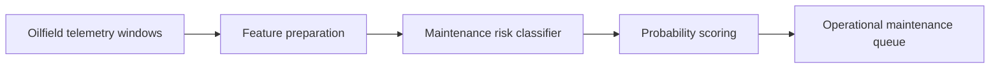

# oilfield-equipment-predictive-maintenance

## Português

`oilfield-equipment-predictive-maintenance` é um projeto de manutenção preditiva para equipamentos de campo em oil & gas. O objetivo é detectar janelas operacionais com risco elevado de intervenção antes que a falha se materialize em parada ou perda operacional.

### Base pública escolhida

O projeto usa como referência pública o **3W Dataset**, da Petrobras, conhecido por tratar eventos indesejáveis raros em poços de petróleo e gás. Essa escolha dá relevância real ao domínio, porque o problema parte de telemetria operacional de oil & gas em vez de usar uma base genérica de indústria.

Como a base pública completa não é embutida diretamente no repositório, o runtime usa uma **amostra local 3W-style** com schema inspirado no problema real para manter a execução leve, determinística e fácil de validar.

Referência local:

- [public_dataset_reference.json](/Users/flaviagaia/Documents/CV_FLAVIA_CODEX/oilfield-equipment-predictive-maintenance/data/raw/public_dataset_reference.json)

### Storytelling técnico

Manutenção preditiva em oil & gas raramente é só “prever falha”. Na prática, o objetivo operacional é transformar sinais de degradação em uma decisão antecipada:

- qual ativo está se aproximando de uma condição crítica?
- qual janela já merece inspeção ou intervenção?
- quais sensores explicam esse risco?

Esse projeto foi desenhado com essa mentalidade. Em vez de trabalhar apenas com o conceito abstrato de falha, ele modela **janelas de telemetria** e classifica se aquela janela já indica condição suficiente para manutenção.

### O que o projeto faz

O pipeline:

1. gera uma base `3W-style` de telemetria de ativos de campo;
2. cria um rótulo binário `maintenance_required`;
3. separa treino e teste de forma estratificada;
4. aplica um pipeline com pré-processamento e `RandomForestClassifier`;
5. gera probabilidade de manutenção por janela;
6. exporta artefatos para análise operacional.

### Arquitetura do repositório

- [src/sample_data.py](/Users/flaviagaia/Documents/CV_FLAVIA_CODEX/oilfield-equipment-predictive-maintenance/src/sample_data.py)  
  Gera a base sintética inspirada no 3W e registra a referência pública.
- [src/modeling.py](/Users/flaviagaia/Documents/CV_FLAVIA_CODEX/oilfield-equipment-predictive-maintenance/src/modeling.py)  
  Implementa o pipeline de classificação e a avaliação.
- [main.py](/Users/flaviagaia/Documents/CV_FLAVIA_CODEX/oilfield-equipment-predictive-maintenance/main.py)  
  Executa o benchmark ponta a ponta.
- [tests/test_project.py](/Users/flaviagaia/Documents/CV_FLAVIA_CODEX/oilfield-equipment-predictive-maintenance/tests/test_project.py)  
  Garante o contrato mínimo do projeto.

### Pipeline conceitual

## Dataset local

Arquivo principal:

- [oilfield_telemetry_3w_style_sample.csv](/Users/flaviagaia/Documents/CV_FLAVIA_CODEX/oilfield-equipment-predictive-maintenance/data/raw/oilfield_telemetry_3w_style_sample.csv)

### O que a base contém

Cada linha representa uma janela operacional de um ativo:

- `asset_id`
- `window_id`
- `discharge_pressure`
- `suction_pressure`
- `line_pressure`
- `temperature`
- `vibration`
- `motor_current`
- `flow_rate`
- `maintenance_required`

### Como a base foi desenhada

A amostra local foi construída para representar um padrão plausível de degradação operacional:

- aumento gradual de `vibration`;
- elevação de `temperature`;
- aumento de `motor_current`;
- queda de `flow_rate`;
- deterioração de `discharge_pressure`.

O rótulo `maintenance_required` aparece quando essa combinação de sinais ultrapassa um limiar de risco ou quando um evento indesejado é introduzido de forma controlada.

## Técnicas utilizadas

### 1. Pré-processamento estruturado

O pipeline separa:

- features numéricas;
- feature categórica `asset_id`.

Para isso, usa `ColumnTransformer` com:

- `SimpleImputer(strategy="median")` para numéricas;
- `SimpleImputer(strategy="most_frequent")` para categóricas;
- `OneHotEncoder(handle_unknown="ignore")` para `asset_id`.

Isso permite tratar o tipo do ativo como informação útil sem quebrar o pipeline.

### 2. Classificação supervisionada

O modelo principal é um `RandomForestClassifier`.

Motivo da escolha:

- lida bem com relações não lineares;
- funciona bem em problemas tabulares com sinais heterogêneos;
- é uma baseline forte e interpretável para MVPs de manutenção preditiva.

### 3. Probabilidade de manutenção

O pipeline não gera só um rótulo binário. Ele produz uma `predicted_probability` por janela.

Isso é importante porque, em operação, a probabilidade costuma ser mais útil do que a classe pura para:

- priorizar ativos;
- ordenar fila de manutenção;
- definir thresholds diferentes por criticidade.

## Estratégia de modelagem

O pipeline executa:

1. leitura da base de telemetria;
2. separação entre features e rótulo;
3. divisão `train/test` estratificada;
4. pré-processamento de dados;
5. treino do classificador;
6. predição de probabilidade;
7. avaliação por métricas de classificação;
8. exportação das janelas pontuadas.

## Métricas

O benchmark usa:

- `ROC-AUC`
- `Average Precision`
- `F1`

### `ROC-AUC`

Pergunta:

- o modelo consegue separar janelas normais e janelas com necessidade de manutenção?

### `Average Precision`

Pergunta:

- quão bem o modelo prioriza os casos positivos em um cenário desbalanceado?

Essa métrica é importante porque manutenção preditiva costuma ter eventos raros e custo alto de erro.

### `F1`

Pergunta:

- como o modelo se comporta no equilíbrio entre precisão e recall no threshold atual?

## Resultados atuais

- `dataset_source = 3w_style_oilfield_telemetry_sample`
- `row_count = 540`
- `asset_count = 6`
- `positive_rate = 0.3519`
- `roc_auc = 0.9381`
- `average_precision = 0.9308`
- `f1 = 0.8409`

### Interpretação dos resultados

O benchmark mostra um modelo forte para o sample atual:

- separação robusta entre janelas normais e janelas críticas;
- boa priorização dos casos com manutenção requerida;
- desempenho coerente para um MVP de manutenção preditiva.

Como a base ainda é sintética, esses números devem ser lidos como validação estrutural da arquitetura e da lógica do problema, não como estimativa direta de produção.

## Artefatos gerados

- [maintenance_scored_windows.csv](/Users/flaviagaia/Documents/CV_FLAVIA_CODEX/oilfield-equipment-predictive-maintenance/data/processed/maintenance_scored_windows.csv)
- [oilfield_predictive_maintenance_report.json](/Users/flaviagaia/Documents/CV_FLAVIA_CODEX/oilfield-equipment-predictive-maintenance/data/processed/oilfield_predictive_maintenance_report.json)

### Como ler os artefatos

`maintenance_scored_windows.csv`:

- mostra as janelas do conjunto de teste;
- inclui rótulo real, probabilidade prevista e classe prevista.

`oilfield_predictive_maintenance_report.json`:

- consolida as métricas do benchmark;
- registra o tamanho da base e os caminhos dos artefatos.

## Limitações atuais

- o runtime usa sample `3W-style`, não a base pública completa;
- o benchmark ainda é offline;
- o projeto ainda não inclui séries temporais contínuas com stream real;
- não há integração com sistema real de ordens de manutenção.

## Próximos passos naturais

- conectar a base pública completa do 3W;
- transformar a classificação por janela em pipeline temporal com rolling windows;
- integrar alertas por ativo;
- medir drift dos sensores;
- incorporar prioridade operacional por tipo de equipamento;
- acoplar o pipeline a uma arquitetura em nuvem com batch e streaming.

## English

`oilfield-equipment-predictive-maintenance` is a predictive maintenance project for oilfield equipment, built around a public 3W-style telemetry framing and designed to score maintenance risk from operational windows.

### Public Dataset Reference

The project uses the Petrobras **3W Dataset** as its public domain reference because it is directly related to rare undesirable events in oil wells and oilfield operations.

### Current Results

- `dataset_source = 3w_style_oilfield_telemetry_sample`
- `row_count = 540`
- `asset_count = 6`
- `positive_rate = 0.3519`
- `roc_auc = 0.9381`
- `average_precision = 0.9308`
- `f1 = 0.8409`
